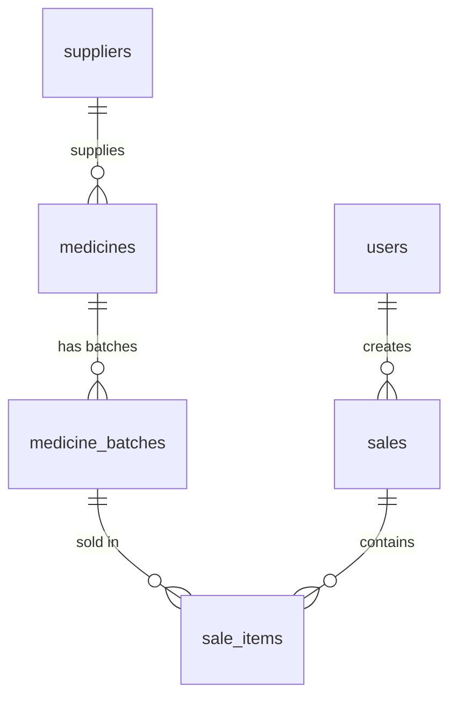

# Database Design — Pharmacy Management System

## Overview

The database uses **PostgreSQL** and consists of **6 tables** organized to support medicine management, supplier tracking, batch/expiry management, stock tracking, sales/billing, and user authentication.

**Key design principle:** Stock is tracked at the batch level. There is no separate `stock` table — the `quantity` column in `medicine_batches` *is* the current stock for that batch. Total stock for a medicine is the sum of its batch quantities.

---

## Entity-Relationship Diagram



---

## Tables

### 1. `users`

Stores login credentials and user roles for authentication.

| Column | Type | Constraints | Description |
|--------|------|-------------|-------------|
| `id` | BIGSERIAL | PRIMARY KEY | Auto-increment ID |
| `username` | VARCHAR(50) | NOT NULL, UNIQUE | Login username |
| `password` | VARCHAR(255) | NOT NULL | BCrypt-hashed password |
| `full_name` | VARCHAR(100) | NOT NULL | Display name |
| `role` | VARCHAR(20) | NOT NULL, DEFAULT 'PHARMACIST' | ADMIN or PHARMACIST |
| `created_at` | TIMESTAMP | NOT NULL, DEFAULT NOW() | Account creation time |

**Constraints:**
- `chk_users_role`: role must be 'ADMIN' or 'PHARMACIST'

---

### 2. `suppliers`

Stores supplier information. Medicines reference suppliers.

| Column | Type | Constraints | Description |
|--------|------|-------------|-------------|
| `id` | BIGSERIAL | PRIMARY KEY | Auto-increment ID |
| `name` | VARCHAR(100) | NOT NULL | Supplier name |
| `phone` | VARCHAR(20) | — | Contact phone |
| `email` | VARCHAR(100) | — | Contact email |
| `address` | TEXT | — | Full address |
| `created_at` | TIMESTAMP | NOT NULL, DEFAULT NOW() | Record creation time |

---

### 3. `medicines`

Stores medicine information. Each medicine can optionally link to a supplier.

| Column | Type | Constraints | Description |
|--------|------|-------------|-------------|
| `id` | BIGSERIAL | PRIMARY KEY | Auto-increment ID |
| `name` | VARCHAR(100) | NOT NULL | Medicine name |
| `category` | VARCHAR(50) | — | Tablet, Syrup, Capsule, etc. |
| `manufacturer` | VARCHAR(100) | — | Manufacturer name |
| `unit_price` | DECIMAL(10,2) | NOT NULL, CHECK > 0 | Selling price per unit |
| `supplier_id` | BIGINT | FK → suppliers(id) ON DELETE SET NULL | Optional supplier link |
| `created_at` | TIMESTAMP | NOT NULL, DEFAULT NOW() | Record creation time |

**Foreign Keys:**
- `supplier_id` → `suppliers(id)` with `ON DELETE SET NULL` (deleting a supplier nullifies the reference, does not delete the medicine)

**Indexes:**
- `idx_medicines_name` on `name`
- `idx_medicines_supplier` on `supplier_id`

---

### 4. `medicine_batches`

Tracks individual batches of a medicine. **This is where stock is tracked** — the `quantity` column represents current available stock for the batch.

| Column | Type | Constraints | Description |
|--------|------|-------------|-------------|
| `id` | BIGSERIAL | PRIMARY KEY | Auto-increment ID |
| `medicine_id` | BIGINT | NOT NULL, FK → medicines(id) ON DELETE CASCADE | Parent medicine |
| `batch_number` | VARCHAR(50) | NOT NULL | Manufacturer batch number |
| `expiry_date` | DATE | NOT NULL | Batch expiry date |
| `quantity` | INTEGER | NOT NULL, CHECK >= 0 | **Current stock** for this batch |
| `purchase_price` | DECIMAL(10,2) | — | Cost price per unit (for reference) |
| `created_at` | TIMESTAMP | NOT NULL, DEFAULT NOW() | Record creation time |

**Constraints:**
- `chk_batches_quantity`: quantity must be >= 0
- `uq_medicine_batch`: UNIQUE on (medicine_id, batch_number) — no duplicate batch numbers for the same medicine

**Foreign Keys:**
- `medicine_id` → `medicines(id)` with `ON DELETE CASCADE`

**Indexes:**
- `idx_batches_medicine` on `medicine_id`
- `idx_batches_expiry` on `expiry_date`

---

### 5. `sales`

Records each sale transaction (header).

| Column | Type | Constraints | Description |
|--------|------|-------------|-------------|
| `id` | BIGSERIAL | PRIMARY KEY | Auto-increment ID |
| `user_id` | BIGINT | FK → users(id) ON DELETE SET NULL | User who made the sale |
| `total_amount` | DECIMAL(10,2) | NOT NULL | Backend-calculated total |
| `sale_date` | TIMESTAMP | NOT NULL, DEFAULT NOW() | Date/time of sale |

**Foreign Keys:**
- `user_id` → `users(id)` with `ON DELETE SET NULL`

**Indexes:**
- `idx_sales_date` on `sale_date`

---

### 6. `sale_items`

Individual line items within a sale. References the specific batch that was sold.

| Column | Type | Constraints | Description |
|--------|------|-------------|-------------|
| `id` | BIGSERIAL | PRIMARY KEY | Auto-increment ID |
| `sale_id` | BIGINT | NOT NULL, FK → sales(id) ON DELETE CASCADE | Parent sale |
| `batch_id` | BIGINT | NOT NULL, FK → medicine_batches(id) | Batch sold from |
| `quantity` | INTEGER | NOT NULL, CHECK > 0 | Quantity sold |
| `unit_price` | DECIMAL(10,2) | NOT NULL, CHECK >= 0 | Price at time of sale |
| `subtotal` | DECIMAL(10,2) | NOT NULL, CHECK >= 0 | quantity × unit_price |

**Foreign Keys:**
- `sale_id` → `sales(id)` with `ON DELETE CASCADE`
- `batch_id` → `medicine_batches(id)`

**Indexes:**
- `idx_sale_items_sale` on `sale_id`
- `idx_sale_items_batch` on `batch_id`

---

## Design Rationale

### Why no separate stock table?

The `medicine_batches.quantity` field IS the stock. Total stock for any medicine can be computed as:

```sql
SELECT SUM(quantity) FROM medicine_batches WHERE medicine_id = ?
```

This avoids maintaining a separate stock table that must be kept in sync with batch data — a common source of bugs.

### Why do sale_items reference batch_id instead of medicine_id?

This enables:
1. **Expiry traceability** — know exactly which batch was sold
2. **FEFO (First Expired, First Out)** — the backend can automatically select the nearest-expiry batch
3. **Accurate stock reduction** — deduct from the specific batch

The medicine information is accessible via `batch → medicine` join.

### Why is unit_price stored in sale_items?

The price at time of sale is captured as a snapshot. If the medicine price changes later, historical sale records remain accurate.

### Why ON DELETE SET NULL for supplier_id?

Deleting a supplier should not cascade-delete all medicines supplied by them. The medicines remain; they just lose the supplier link.

---

## Stock Computation Examples

**Total stock for a medicine:**
```sql
SELECT m.name, COALESCE(SUM(mb.quantity), 0) AS total_stock
FROM medicines m
LEFT JOIN medicine_batches mb ON m.id = mb.medicine_id
GROUP BY m.id, m.name;
```

**Low stock medicines (threshold = 10):**
```sql
SELECT m.id, m.name, COALESCE(SUM(mb.quantity), 0) AS total_stock
FROM medicines m
LEFT JOIN medicine_batches mb ON m.id = mb.medicine_id
GROUP BY m.id, m.name
HAVING COALESCE(SUM(mb.quantity), 0) < 10;
```

**Expired batches:**
```sql
SELECT mb.*, m.name AS medicine_name
FROM medicine_batches mb
JOIN medicines m ON mb.medicine_id = m.id
WHERE mb.expiry_date < CURRENT_DATE;
```

**Batches expiring within 30 days:**
```sql
SELECT mb.*, m.name AS medicine_name
FROM medicine_batches mb
JOIN medicines m ON mb.medicine_id = m.id
WHERE mb.expiry_date BETWEEN CURRENT_DATE AND CURRENT_DATE + INTERVAL '30 days';
```
